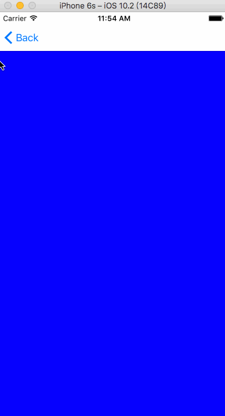
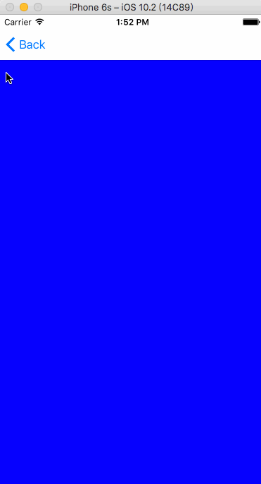

# Navigation-bar-problem-summary
###iOS开发中导航栏结合滑动返回手势中的那些坑点

> 1. 设置状态栏结合滑动手势对导航栏的影响。
> 2. 从有导航栏的界面无动画跳转到首页后对导航栏的影响。
> 3. 自定义导航栏导致滑动返回手势失效。
> 4. 滑动返回时，导航栏割裂的解决办法。
> 5. iOS10和iOS10以下系统设置透明状态栏不同的方法。
> 6. 当自定义导航栏后滑动返回手势失效，使用设置代理的方式重新开启返回手势后，首页滑动返回，界面假死。


####1. 设置状态栏结合滑动手势对导航栏的影响。
```
- (UIStatusBarStyle) preferredStatusBarStyle（NS_AVAILABLE_IOS(7_0) __TVOS_PROHIBITED）
{
    return UIStatusBarStyleLightContent;
}
```
```
NS_DEPRECATED_IOS(2_0, 9_0, "Use -[UIViewController preferredStatusBarStyle]") __TVOS_PROHIBITED

 [[UIApplication sharedApplication] setStatusBarStyle:UIStatusBarStyleLightContent];
```

第一个设置导航栏的方法按道理应该在iOS10以及以上的系统里用，但是结合滑动返回手势后，却会产生一个莫名其妙的bug,这个bug还不知道具体是什么原因，目测应该是苹果内部调用冲突了。
如果使用第二个方法来代替第一个方法，即使这个方法已经在iOS10中过期了。



####2. B项目中从有导航栏的界面无动画跳转到首页后对导航栏的影响。

```
[self.navigationController setNavigationBarHidden:NO animated:animated];
```
切记不要单纯的将animated写死成YES或者NO，这里应该考虑到两种应用场景：
>一种是POP和PUSH不带动画    animated == NO

>一种是POP和PUSH带动画      animated == YES

####3. 自定义导航栏导致滑动返回手势失效。

先说解决方案

```
  
    if ([self respondsToSelector:@selector(interactivePopGestureRecognizer)]) {
        self.interactivePopGestureRecognizer.delegate = weakself;
    }
    
    同时实现代理方法<UIGestureRecognizerDelegate>  为什么要实现这个代理方法之后会讲到
    - (BOOL)gestureRecognizerShouldBegin:(UIGestureRecognizer *)gestureRecognizer
{
    if (self.viewControllers.count <= 1) {
        return NO;
    }
    return YES;
}
```

####4、滑动返回时，导航栏割裂的解决办法。



使用

```
 [self.navigationController setNavigationBarHidden:NO animated:animated];
```
而不是使用

```
self.navigationController.navigationBar.hidden = NO;
```

####5、iOS10和iOS10以下系统设置透明状态栏不同的方法。
```
//设置透明导航栏代码
self.navigationController.navigationBar.translucent = NO;
[self.navigationController setNavigationBarHidden:NO animated:YES];
[self.navigationController.navigationBar setBackgroundImage:[UIImage imageNamed:@"statusBar"] forBarMetrics:UIBarMetricsDefault];
self.navigationController.navigationBar.shadowImage =[UIImage imageNamed:@"statusBar"];
self.navigationController.navigationBar.translucent = YES;
```

>1、UIBarMetricsDefault,竖屏横屏都有，横屏导航条变宽，则自动repeat图片

>2、UIBarMetricsCompact,竖屏没有，横屏有，相当于之前老iOS版本里地UIBarMetricsLandscapePhone

>3、UIBarMetricsDefaultPrompt = 101, // Applicable only in bars with the prompt property, such as UINavigationBar and UISearchBar
IOS 

>4、UIBarMetricsCompactPrompt, 设置navigationbar为透明的UIBarMetricsCompactPrompt

>5、UIBarMetricsLandscapePhone NS_ENUM_DEPRECATED_IOS(5_0, 8_0, "Use UIBarMetricsCompact instead") = UIBarMetricsCompact,

>6、UIBarMetricsLandscapePhonePrompt NS_ENUM_DEPRECATED_IOS(7_0, 8_0, "Use UIBarMetricsCompactPrompt") = UIBarMetricsCompactPrompt,

####6、当自定义导航栏后滑动返回手势失效，使用设置代理的方式重新开启返回手势后，首页滑动返回，界面假死。
解决办法

```
/**
 返回手势代理，解决返回手势造成的界面假死等情况

 @param gestureRecognizer 手势

 @return bool
 */
- (BOOL)gestureRecognizerShouldBegin:(UIGestureRecognizer *)gestureRecognizer
{
	//当当前界面是导航栏最外层的控制器时，关闭返回手势
    if (self.viewControllers.count <= 1) {
        return NO;
    }
    return YES;
}

```

